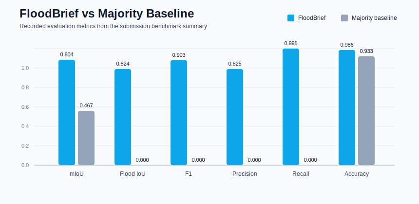

# FloodBrief

FloodBrief is a flood-triage app for Sentinel-1 SAR imagery. It segments flooded pixels, estimates flooded area, assigns urgency, and returns a compact downlink decision instead of forcing operators to move raw imagery first.

## Judge Quickstart

If you want the app running fast, use the lightweight demo stack:

**Windows:**
```powershell
git clone https://github.com/Yellow-Bulldozer/FloodBrief.git
cd FloodBrief
py -3.11 -m venv .venv
.\.venv\Scripts\activate
pip install -r requirements-app.txt
python app.py
```

**macOS / Linux:**
```bash
git clone https://github.com/Yellow-Bulldozer/FloodBrief.git
cd FloodBrief
python3 -m venv .venv
source .venv/bin/activate
pip install -r requirements-app.txt
python app.py
```

Open `http://localhost:7860`. Leave `Use built-in synthetic demo tile` checked and click **Run FloodBrief** — no dataset download required.

To use a real Sentinel-1 tile instead: uncheck the box and upload any `_S1Hand.tif` file from Sen1Floods11.

If you want the full TerraTorch training/evaluation workflow:

```bash
pip install -r requirements.txt
```

## What The UI Shows

- Per-tile results table with flood area, flood fraction, confidence, urgency, latency, and JSON size.
- A comparison chart between the current FloodBrief model and a majority-class baseline.
- Repo benchmark numbers surfaced directly in the UI so judges do not need to hunt through files.

## Benchmarks

### Model artifacts and speed

| Item | Value |
|---|---|
| Deployment checkpoint | `checkpoints/final_model.pt` = `94.09 MB` on disk |
| Training checkpoint | `checkpoints/best_model.pt` = `281.55 MB` on disk |
| Recorded evaluation speed | `237.28 ms/tile` or about `4.21 tiles/s` |
| Estimated orbital speed | about `2.00 s/tile` or `0.50 tiles/s` on Jetson Orin Nano 8 GB |

The checkpoint sizes above are the actual on-disk sizes from the submission artifacts. The Jetson number is an engineering estimate for orbital deployment, not a measured device benchmark.

### FloodBrief vs majority baseline

| Metric | FloodBrief | Majority baseline | Delta |
|---|---:|---:|---:|
| mIoU | 0.9042 | 0.4665 | +0.4377 |
| Flood IoU | 0.8237 | 0.0000 | +0.8237 |
| F1 (flood) | 0.9034 | 0.0000 | +0.9034 |
| Precision | 0.8249 | 0.0000 | +0.8249 |
| Recall | 0.9983 | 0.0000 | +0.9983 |
| Accuracy | 0.9857 | 0.9331 | +0.0526 |



### Product-level triage metrics

| Metric | Value |
|---|---|
| Tiles evaluated | 50 |
| Bandwidth saved | 32.0% |
| Flood-event retention | 100.0% |
| Downlink precision | 100.0% |

## Project Layout

```text
FloodBrief/
|-- app.py
|-- infer.py
|-- evaluate.py
|-- train.py
|-- train_terratorch.py
|-- requirements-app.txt
|-- requirements.txt
|-- configs/
|-- docs/
|-- sample_output/
`-- src/
```

## Notes

- `requirements-app.txt` is the shortest path to a runnable demo.
- `requirements.txt` keeps the full training and geospatial stack.
- The app works with a built-in synthetic demo tile, so a judge can verify the UI immediately after cloning.
- If TerraMind weights or a local checkpoint are unavailable, the code falls back to a lightweight demo encoder so the app still starts cleanly.
